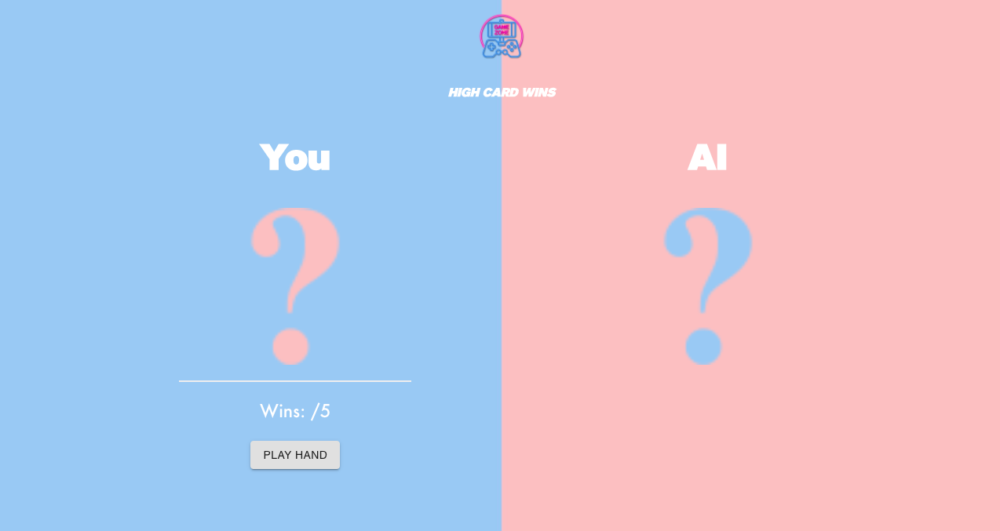
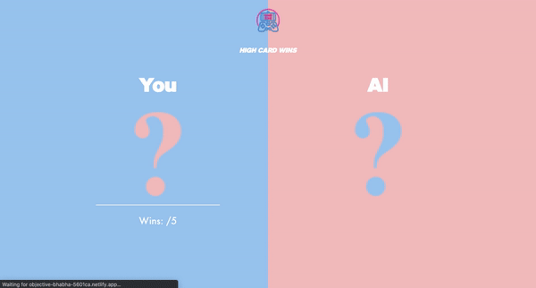

## Card Game

52 card deck game, you vs. the computer! First to score 5 points wins the game


## Table Of Contents
- [User Story](#User-Story)
- [Technology](#Technology)
- [Link to depolyed app](#Link-to-depolyed-app)

## User Story
```
As a card game player
I want to randomly select a card from a deck and have a computer oppenent do the same
So that one has the higher card and wins that round for a total of 5 rounds 
The first to win 5 rounds determining the winner of the game
```

## Technology
* Javascript
* React.js
* Material-UI

# Demonstration


### Linked To Deployed App
https://objective-bhabha-5601ca.netlify.app

